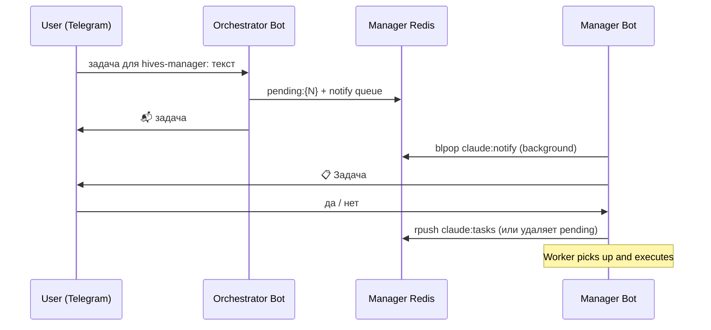

# Orchestrator — Telegram Bot

Routes tasks to project-manager instances and monitors their health.

## How it works



## Commands

| Command | Description |
|---|---|
| `задача для [manager]: [text]` | Route task to a specific manager |
| `кто делает [project]?` | Find which manager handles a project |
| `задачи` | List all pending tasks across all managers |
| `статус [manager]` | Last task result for a manager |
| `/status` | Health check all managers |
| `/managers` | List managers with queue lengths |

## Configuration

### `.env`

| Variable | Description |
|---|---|
| `TELEGRAM_BOT_TOKEN` | Token from @BotFather |
| `ALLOWED_USER_IDS` | Comma-separated Telegram user IDs |
| `WEBHOOK_URL` | `https://your-domain:8443/webhook` |
| `PORT` | Listening port (default: `8001`) |
| `ALERT_CHAT_ID` | Chat to send watchdog alerts to |
| `MANAGER_CHECK_INTERVAL` | Seconds between health checks (default: `300`) |
| `MANAGERS_CONFIG` | Path to managers.yaml (default: `managers.yaml`) |

### `managers.yaml`

```yaml
managers:
  - name: hives-manager
    description: "Manages hives project (Node.js)"
    projects:
      - hives
    redis_url: "redis://localhost:6379"
    task_queue: "claude:tasks:hives"
    last_result: "claude:last_result:hives"
    health_url: "https://your-domain/health"      # optional HTTP health check
    notify_queue: "claude:notify"                  # where manager bot listens
    task_counter: "claude:task_counter"
    pending_prefix: "claude:pending:"
    progress_key: "claude:in_progress"
    heartbeat_key: "claude:worker:heartbeat"
```

## Watchdog

Runs every `MANAGER_CHECK_INTERVAL` seconds. **Only alerts when there is active work** — skips notification if all queues are empty.

Each check verifies:
- HTTP `/health` endpoint (if `health_url` configured)
- Worker heartbeat key in Redis (only if queue or in-progress task exists)

## Running

```bash
python3 -m venv .venv && source .venv/bin/activate
pip install -r requirements.txt
cp .env.example .env && nano .env
uvicorn bot:app --host 0.0.0.0 --port 8443 \
  --ssl-keyfile server.key --ssl-certfile server.crt
```
